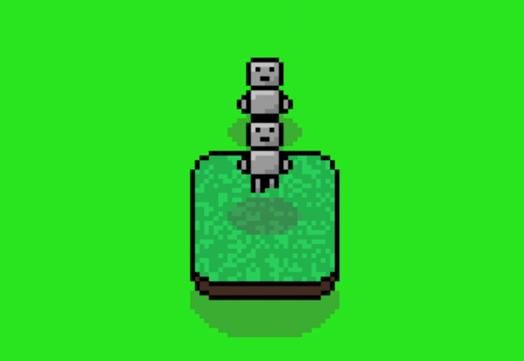

# Making Your First Game, Part 1: Quickstart

## Introduction
This tutorial series will guide you towards making your first game in pygame-topdownengine! This tutorial series assumes you have prior Python programming experience and have decent knowledge of pygame-ce terminology (`Surface`, `Rect`, etc.).

In this quickstart, we will be guiding you towards creating a player character you can move with WASD on your keyboard, a secondary character that will attempt to follow the player, and a solid object the player can collide with and jump over.

<figure markdown="span" style="text-align: center;">
    
    <figcaption>The player (a `MobileObject`) jumping onto a collidable object (an `EnvObject`) while being chased by the enemy (another `MobileObject`).</figcaption>
</figure>

## Importing Dependencies
Let's get the ball rolling! Before we can do anything however, we will need to import the engine and pygame-ce.
```
# Import the main engine
import topdownengine as tde

# The first import allows for keyboard-based movement and the second one allows for AI-based movement.
from topdownengine.mobile_object.controller import KeyboardInputController, MovementAIController

# pygame-ce provides us with some really helpful utilities.
import pygame as pg

# We will need this for the main menu.
from topdownengine.ui import Button, UIContainer, Text
```

## The Game Class
Great! Now that we have imported everything, let's define the first thing you will define in every project you make. The Game class mainly functions as a wrapper for updates and rendering, but it is also used by individual `GameObject`s for a variety of things.
```
# Define an instance of the Game class
game = tde.Game(
    screen_width=900, 
    screen_height=650, 
    window_title="pygame-topdownengine Basic Usage Example",
    target_scale=3 # Add scale of three to make it more visible
)
game.bg_color = (40, 229, 30) # Give it a background color
```

## The Main Menu
Before we get started with anything else, let's implement a (very basic) main menu. In our main menu, we will add a very basic header/title and a play button.
```
# Define main menu using a BaseScene instance + set the active scene to the main menu
game.scenes["menu"] = tde.BaseScene(game)
game.active_scene_key = "menu"

# Create the play button + header
font = tde.Font("Arial")
header = Text((450, 200), font, 50, "pygame-topdownengine", (255, 255, 255))

play_btn = Button((450, 350), on_click=lambda: setattr(game, "active_scene_key", "gameplay"))
play_btn.image = pg.Surface((150, 50))
play_btn.image.fill((0, 0, 0))
font.draw_text("PLAY", 75, 25, 40, play_btn.image, (255, 255, 255))

# Add the header + play button to the main menu
container = UIContainer()
container.add_ui_element(header)
container.add_ui_element(play_btn)
game.scenes["menu"].ui_containers.append(container)
```

!!! info "Scenes"
    The `BaseScene` is the base class for all "scenes" in the engine. A "scene" 
    controls the update loop and rendering of the game. By default, the `Game` class 
    defines a `GameplayScene` object at `Game.scenes["gameplay"]`. The `GameplayScene` 
    has very basic logic that updates and renders all `GameObject`s. This is why we 
    set the `active_scene_key` to `"gameplay"` when the play button is pressed. Every 
    scene has the same UI capabilities we used to create our main menu, including the 
    `GameplayScene`.

## The Player
Now that we have a `Game` instance and we have made our main menu, the next thing we will define is the Player. The base class for every in-world object in the engine is the `GameObject` class. However, in this tutorial, we won't be instantiating it directly. For example, to define the player, which we will do in a moment, we will use the `MobileObject` class, which is a subclass of `GameObject` with extra movement features.

This code gives the player keyboard movement and animations (using the package's premade animations).
```
# Define a MobileObject to be the Player + Enable Camera Tracking
player = tde.MobileObject(
    controller=KeyboardInputController(), 
    animation_paths={
        "idle": tde.ASSETS_DIR / "example-player" / "idle.png",
        "walk": tde.ASSETS_DIR / "example-player" / "walk.png"
    }, frame_size=(16, 16), directional_anims=True
)
game.camera.focus_game_object = player
```

## The Enemy
Now let's make the `MobileObject` that follows you. For the purposes of this tutorial, let's call it the "enemy". This code makes the enemy follow the player and uses the same animations as the player.
```
# Define a MobileObject to follow the Player
enemy = tde.MobileObject(
    controller=MovementAIController(target_mobile_obj=player), 
    animation_paths=player.animation_paths, # Use same animations as the Player
    frame_size=(16, 16), directional_anims=True
)
```

## EnvObject
Another subclass of `GameObject` is `EnvObject`. It is used to define environmental objects and decorations. Using it, let's define a box the player can collide with and jump over. Essentially, this code will make the box 32x32 in world space, give it a shadow, and set its position away from (0, 0), which is the default position for all `GameObject`s.
```
env_object = tde.EnvObject(
    animation_paths={
        "idle": tde.ASSETS_DIR / "example-cliff.png"
    },
    frame_size=(32, 32), colliders=[pg.Rect(0, 0, 32, 32)]
)
env_object.position = pg.Vector2(100, 100)
env_object.obj_shadow = "32x16"
```

## Adding Them to the Game
Now, we need to add these three to the `Game` itself. In order to do that, we add each one to the `Game` instance's `game_object_group` attribute.
```
# Add them to the game object group
game.game_object_group.add(player, env_object, enemy)
```

## Subpixel vs Pixel-Perfect Rendering
pygame-topdownengine offers both pixel-perfect rendering and subpixel rendering out of the box. By default, pixel-perfect rendering is used. However, if you want subpixel rendering to make it more smooth, you can do that with this code:
```
tde.GameObject.SUBPIXEL = True
```

## Execution
You made it! If you got to this point in this tutorial, you're almost there. Before everything's well and done, we need to actually run the game. To do that, we call the `run` method on the `Game` instance as shown below:

```
# Run the game
game.run()
```

If everything went right, you should have a character you can control with WASD (with Space for jump), another character that follows you, and a red box you can jump over and collide with! If all's not well, check out the example code on [GitHub](https://github.com/shaurya-sharma-dev/pygame-topdownengine/blob/main/examples/basic_usage.py) to see what went wrong.